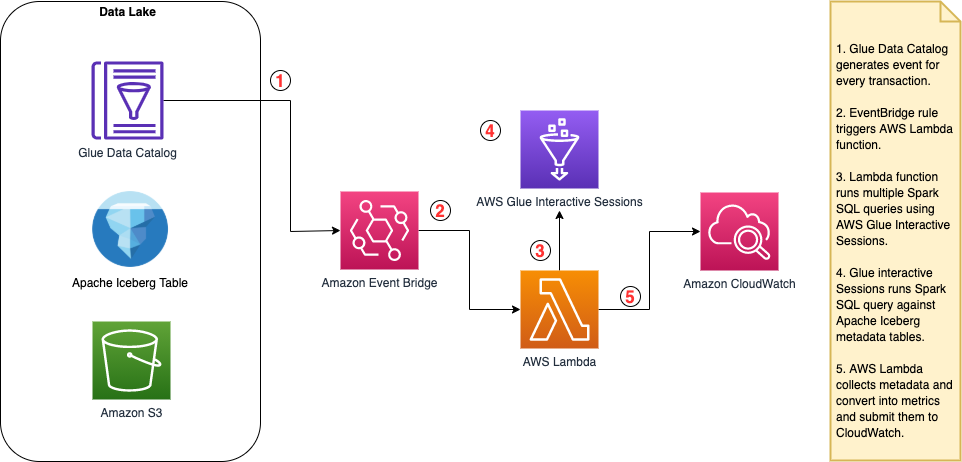

## Monitoring Apache Iceberg Table metadata layer using AWS Lambda, AWS Glue and AWS CloudWatch

This repository provides you with a sample solution that collects metrics of existing Apache Iceberg tables managed in your Amazon S3 and catalogued to AWS Glue Data Catalog. The solution consists of AWS Lambda deployment package that collects and submits metrics into AWS CloudWatch. Repository also includes helper script for deploying CloudWatch monitoring dashboard to visualize collected metrics.

### Table of Contents
- [Solution Tenets](#solution-tenets)
- [Technical implementation](#technical-implementation)
- [Metrics collected](#metrics-collected)
- [Setup](#setup)
    - [Prerequisites](#prerequisites)
    - [Build and Deploy](#build-and-deploy)
    - [Test Locally](#test-locally)
- [Dependencies](#dependencies)
- [Clean Up](#clean-up)
- [Security](#security)
- [License](#license)

### Solution Tenets
* Solution is designed to provide time-series metrics for Apache Iceberg to monitor Apache Iceberg tables over-time to recognize trends and anomalies. 
* Solution is designed to be lightweight and collect metrics exclusively from Apache Iceberg metadata layer without scanning the data layer hense without the need for heavy compute capacity.
* In the future we strive to reduce the dependency on AWS Glue in favor of using AWS Lambda compute when required features are available in [PyIceberg](https://py.iceberg.apache.org) library.

### Technical implementation



* Amazon EventBridge rule triggers AWS Lambda on every event of  *Glue Data Catalog Table State Change*. Event triggered every time transaction committed to Apache Iceberg Table.
* Triggered AWS Lambda code aggregates information retrieved from metadata tables to create [metrics](#metrics-collected) and submits those to Amazon CloudWatch.
* AWS Lambda code includes `pyiceberg` library and [AWS Glue interactive Sessions](https://docs.aws.amazon.com/glue/latest/dg/interactive-sessions-overview.html) with minimal compute to read `snapshots`, `partitions` and `files` Apache Iceberg metadata tables with Apache Spark.


### Metrics collected
*Snapshot metrics*
* snapshot.total_data_files
* snapshot.added_data_files
* snapshot.deleted_data_files
* snapshot.total_delete_files
* snapshot.added_records
* snapshot.deleted_records
* snapshot.added_files_size
* snapshot.removed_files_size
* snapshot.added_position_deletes

*Partitions aggregated metrics*
* partitions.avg_record_count
* partitions.max_record_count
* partitions.min_record_count
* partitions.deviation_record_count
* partitions.skew_record_count
* partitions.avg_file_count
* partitions.max_file_count
* partitions.min_file_count
* partitions.deviation_file_count
* partitions.skew_file_count

*Per-partition metrics*
* partitions.file_count
* partitions.record_count

*Files aggregated metrics*
* files.avg_record_count
* files.max_record_count
* files.min_record_count
* files.avg_file_size
* files.max_file_size
* files.min_file_size

## Setup

### Prerequisites

#### Install Docker

This solution uses Docker as a dependency for AWS SAM CLI.
To install Docker follow Docker official documentation.
https://docs.docker.com/get-docker/

#### Install SAM CLI

This solution is using AWS SAM CLI to build test and deploy AWS Lambda code that collects the Iceberg table metrics and submits them into AWS CloudWatch.

To install AWS SAM CLI follow AWS Documentation. \
https://docs.aws.amazon.com/serverless-application-model/latest/developerguide/install-sam-cli.html


#### Configuring IAM permissions for AWS Glue

- [Step 1: Create an IAM policy for the AWS Glue service](https://docs.aws.amazon.com/glue/latest/dg/create-service-policy.html)
- [Step 2: Create an IAM role for AWS Glue](https://docs.aws.amazon.com/glue/latest/dg/create-an-iam-role.html)

### Build and Deploy

> ! Important - The guidance below uses AWS Serverless Application Model (SAM) for easier packaging and deployment of AWS Lambda. However if you use your own packaging tool or if you want to deploy AWS Lambda manually you can explore following files:
> - template.yaml
> - lambda/requirements.txt
> - lambda/app.py

#### 1. Build AWS Lambda using AWS SAM CLI

Once you've installed [Docker](#install-docker) and [SAM CLI](#install-sam-cli) you are ready to build the AWS Lambda. Open your terminal and run command below.

```bash
sam build --use-container
```

#### 2. Deploy AWS Lambda using AWS SAM CLI

Once build is finished you can deploy your AWS Lambda. SAM will upload packaged code and deploy AWS Lambda resource using AWS CloudFormation. Run below command using your terminal.

```bash
sam deploy --guided
```

##### Parameters

- `CWNamespace` - A namespace is a container for CloudWatch metrics.
- `GlueServiceRole` - AWS Glue Role arn you created [earlier](#configuring-iam-permissions-for-aws-glue).
- `Warehouse` - Required catalog property to determine the root path of the data warehouse on S3. This can be any path on your S3 bucket. Not critical for the solution.


#### 3. Configure EventBridge Trigger

In this section you will configure EventBridge Rule that will trigger Lambda function on every transaction commit to Apache Iceberg table.
Default rule listens to `Glue Data Catalog Table State Change` event from all the tables in Glue Data Catalog catalog. Lambda code knows to skip non-iceberg tables.
If you want to scope triggers to specific Iceberg Tables and not collecting metrics from all of them you can uncomment `glue_table_names = ["<<REPLACE TABLE 1>>", "<<REPLACE TABLE 1>>"]` and add relevant table names.

```python
import boto3
import json

# Initialize a boto3 client
session = boto3.Session(region_name='<<SET CORRECT AWS REGION>>')
lambda_client = session.client('lambda')
events_client = session.client('events')

# Parameters
lambda_function_arn = '<<REPLACE WITH LAMBDA FUNCTION ARN>>'
glue_table_names = None
# glue_table_names = ["<<REPLACE TABLE 1>>", "<<REPLACE TABLE 1>>"]

# Create EventBridge Rule
event_pattern = {
    "source": ["aws.glue"],
    "detail-type": ["Glue Data Catalog Table State Change"]
}

if glue_table_names:
    event_pattern
    event_pattern["detail"] = {
        "tableName":  glue_table_names   
    }
event_pattern_dump = json.dumps(event_pattern)
rule_response = events_client.put_rule(
    Name='IcebergTablesUpdateRule',
    EventPattern=event_pattern_dump,
    State='ENABLED'
)
# Add Lambda as a target to the EventBridge Rule
events_client.put_targets(
    Rule='IcebergTablesUpdateRule',
    Targets=[
        {
            'Id': '1',
            'Arn': lambda_function_arn
        }
    ]
)
print(f"Pattern updated = {event_pattern_dump}")
```

#### 4. (Optional) Create CloudWatch Dashboard
Once your Iceberg Table metrics are submitted to CloudWatch you can start using them to monitor and create alarms. CloudWatch also let you visualize metrics using CloudWatch Dashboards.

`assets/cloudwatch-dashboard.template.json` is a sample CloudWatch dashboard configuration that uses fraction of the submitted metrics and combines it with AWS Glue native metrics for Apache Iceberg. 
We use Jinja2 so you could generate your own dashboard by providing your parameters.


Run the script below to generate your own CloudWatch dashboard configuration.
Replace input values with the relevant [parameters](#parameters) from previous sections.

```python
import json
from jinja2 import Template

def render_json_template(template_path, data):
    with open(template_path, 'r') as file:
        template_text = file.read()

    template = Template(template_text)
    rendered_json = template.render(data)
    json_data = json.loads(rendered_json)
    return json_data

# Data to fill in the template
data = {
    "CW_NAMESPACE": "<<REPLACE>>",
    "REGION": "<<REPLACE>>",
    "DBNAME": "<<REPLACE>>",
    "TABLENAME": "<<REPLACE>>"
}

# Path to cloudwatch template file
template_path = 'assets/cloudwatch-dashboard.template.json'
rendered_data = render_json_template(template_path, data)
output_path = 'assets/cloudwatch-dashboard.rendered.json'

with open(output_path, 'w') as file:
        json.dump(rendered_data, file, indent=4)

print(f"Your dashboard configuration successfully generated at {output_path}")
```

Now follow steps to create CloudWatch dashboard from rendered json.

1. Sign in to the AWS Management Console and navigate to the CloudWatch service.
2. In the navigation pane, click on "Dashboards" on the left pane.
3. Click on "Create Dashboard" and give it a name. 
4. If widget configuration popup appears click "Cancel".
5. Click the "Actions" dropdown menu in the top right corner of the dashboard and select "View/edit source".
This will open a new tab with the source JSON for the dashboard. You can then paste rendered JSON into a Dashboard source to create a custom dashboard resource.
6. Click "Update"
7. The new dashboard supposedly empty. Once your AWS Lambda will generate metrics they will appear here.

### Test Locally

You can test the code locally on using SAM CLI.
Ensure you have configured the [right AWS permissions](https://docs.aws.amazon.com/cli/latest/userguide/cli-chap-configure.html) to call CloudWatch and AWS Glue.

```bash
sam local invoke IcebergMetricsLambda --env-vars .env.local.json
```

`.env.local.json` - The JSON file that contains values for the Lambda function's environment variables. Lambda code is dependent on env vars that you are passing in the deploy section. You need to create the file it and include relevant [parameters](#parameters) before you calling `sam local invoke`.


## Dependencies

PyIceberg is a Python implementation for accessing Iceberg tables, without the need of a JVM. \
https://py.iceberg.apache.org

AWS Serverless Application Model (AWS SAM) \
https://docs.aws.amazon.com/serverless-application-model/latest/developerguide/what-is-sam.html

Docker \
https://docs.docker.com/get-docker/

## Clean Up

1. Delete AWS Lambda `sam delete`.
2. Delete CloudWatch Dashboard.
3. Delete EventBridge rule.

## Security

See [CONTRIBUTING](CONTRIBUTING.md#security-issue-notifications) for more information.

## License

This library is licensed under the MIT-0 License. See the LICENSE file.

